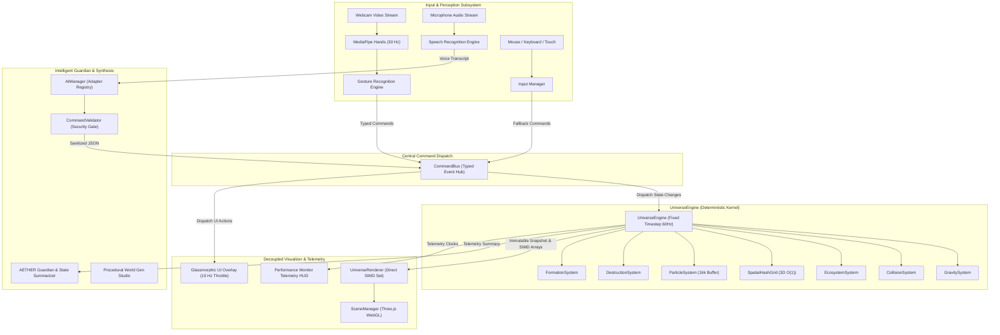
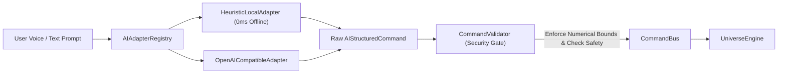

<div align="center">

# 🌌 AETHERIA

### Deterministic Procedural Universe Simulation & Spatial Hand-Tracking Engine

[](https://github.com/Sidd-commits/AETHERIA/actions/workflows/ci.yml)
[](https://www.typescriptlang.org/)
[](https://vitest.dev/)
[](https://eslint.org/)
[](https://www.docker.com/)
[](https://opensource.org/licenses/MIT)

**AETHERIA** is a real-time, deterministic procedural 3D universe simulation and computer vision interaction engine. Built with a decoupled pure-math simulation kernel, scale-invariant hand gesture recognition via MediaPipe, an emergent living particle ecosystem, black hole accretion physics, and natural-language procedural world generation.

[Explore Architecture](docs/architecture.md) • [Performance Benchmarks](docs/performance.md) • [Physics Model](docs/physics.md) • [Contributing Guide](CONTRIBUTING.md)

</div>

---

## 1. Hero & Highlights

```
                       ┌───────────────────────────────┐
                       │       AETHERIA UNIVERSE       │
                       │   16,000+ Cosmic Particles    │
                       └───────────────┬───────────────┘
                                       │
        ┌──────────────────────────────┼──────────────────────────────┐
        ▼                              ▼                              ▼
 🖐️ Spatial Vision              🪐 Deterministic Physics       🧠 Intelligent Guardian
 MediaPipe 30Hz Inference      Softened N-Body Gravity        Natural-Language Synthesis
 11 Scale-Invariant Gestures   O(1) Spatial Hash Grid         AETHER Telemetry & Diagnostics
 Exponential Moving Average    Living Particle Ecosystem      Strict Schema Sandbox Gate
```

- **Extreme Performance**: Interactive **60+ FPS with 10,000 to 16,000+ active particles** on mid-range consumer laptops.
- **Pure-Math Simulation Kernel**: Physics, collisions, and ecosystems execute in a deterministic fixed-timestep loop ($\Delta t = 1/60\text{s}$) completely decoupled from WebGL/Three.js.
- **Zero-Allocation Runtime**: Static typed array memory pools (`Float32Array`, `Int32Array`) completely eliminate per-frame garbage collection pauses.
- **Spatial Hash Grid Partitioning**: Neighborhood searches run in **$O(1)$ time ($4.47\ \mu\text{s}$ per query)**, replacing quadratic $O(N^2)$ collision checks.
- **Scale-Invariant Computer Vision**: 11 semantic hand gestures classified from 21-point 3D hand landmarks with continuous confidence scoring and temporal voting.
- **Offline & Cloud AI Co-Processor**: Natural language universe generation and voice control with 100% offline heuristic NLP fallback and strict JSON schema sandboxing.

---

## 2. Live Demo & Quick Look

### Local Interactive Demo

```bash
git clone https://github.com/Sidd-commits/AETHERIA.git
cd AETHERIA
npm ci
npm run dev
```

Open your browser at `http://localhost:3000/`. Allow webcam permissions for hand gesture control, or use mouse and keyboard fallbacks.

### Quick Keyboard & Gesture Shortcuts

- **`P`**: Toggle Performance Telemetry & Diagnostic HUD
- **`D`**: Toggle Gesture Skeleton & Tracking Debug Overlay
- **`Spacebar`**: Pause / Resume Simulation
- **`R`**: Reset and re-seed active universe preset
- **`0`–`5`**: Switch cosmic color palettes
- **🖐️ `OPEN_PALM`**: Pan & tilt 3D celestial camera
- **👌 `PINCH`**: Gravitational energy accumulation & supernova charge
- **✊ `FIST` + 🌀 `CIRCULAR_MOTION`**: Spawn relativistic Black Hole Singularity

---

## 3. What is AETHERIA?

AETHERIA bridges real-time astrophysics simulation, spatial computing, and artificial intelligence. Rather than relying on static particle animations or visual shaders alone, AETHERIA computes true celestial mechanics, thermodynamics, gravitational collapse, and living particle ecosystems in JavaScript and WebGL.

### Key Engineering Principles

1. **Decoupled Architecture**: The simulation kernel (`UniverseEngine`) has zero knowledge of Three.js or DOM elements. It emits immutable typed snapshots and flat SIMD buffers.
2. **Deterministic Physics**: Fixed-timestep accumulator guarantees identical physical outcomes across 60Hz, 120Hz, 144Hz, and 240Hz monitors.
3. **Scale-Invariant Perception**: Hand gesture recognition relies on normalized geometric ratios and joint angles, functioning consistently regardless of user distance or hand size.
4. **Sandboxed AI Execution**: The AI layer is strictly prohibited from mutating application state or running arbitrary code. It emits validated structured JSON commands processed through a security gate (`CommandValidator`).

---

## 4. Key Features

### 🌌 Procedural Celestial Simulation

- **Softened Celestial N-Body Gravity**: Accurate gravitational interaction between stars, planets, and asteroids with softening parameter $\epsilon^2 = 0.25$ to prevent gravitational singularities.
- **Keplerian Orbital Dynamics**: Calculates stable tangential orbital velocity vectors $\mathbf{v}_{\text{orb}} = \sqrt{G M / r} \cdot \hat{\mathbf{t}}$ for planetary concentric disks.
- **Relativistic Black Holes**: First-class singularity entities featuring event horizon mass absorption, accretion disk radius, and tangential vortex swirling.
- **Supernova Detonations**: Compressional shockwave physics that ionize surrounding matter and propel high-velocity cosmic dust.

### 🧬 Living Particle Ecosystem

- **Three Entity Particle Classes**: `ENERGY`, `MATTER`, and `ORGANISM`.
- **Autonomous Organisms**: Seek energy fields, avoid black holes, consume energy, metabolize over time, and undergo mitotic reproduction when energy exceeds health thresholds.
- **Population Telemetry**: Real-time tracking of birth rates, mortality rates, average age, and net ecological growth.

### 🧠 Intelligent Guardian (AETHER) & Voice Control

- **State Summarizer**: Converts simulation state into compact telemetry (stability score, velocity dispersion $\sigma_v$, anomaly detection).
- **Voice Control HUD**: Ambient speech-to-text with continuous waveform audio visualization and command history.
- **World Generation Studio**: Generates customized universes from natural language prompts (e.g. _"A peaceful blue universe with two suns and a giant black hole in the center"_).

---

## 5. System Architecture



---

## 6. Computer Vision Pipeline

```
  Video Stream (60fps) ──► [ 30Hz Inference Throttle ] ──► MediaPipe Hands (21 3D Points)
                                                                   │
  [ CommandBus Dispatch ] ◄── [ Temporal Voting & Debounce ] ◄─────┴──► [ Adaptive EMA Smoother ]
                                                                             │
                                                                   [ Scale-Invariant Math ]
                                                                   - Reference Palm Scale
                                                                   - Joint Cosine Angles
                                                                   - 3D Palm Normal
                                                                   - Angular Curvature
```

1. **Inference Throttling**: MediaPipe is throttled to 30 Hz (~33.3ms intervals) with an atomic `isProcessingFrame` lock, freeing the JavaScript main thread for 60 FPS physics and WebGL rendering.
2. **Adaptive EMA Landmark Smoothing**: Velocity-sensitive Exponential Moving Average dynamically adjusts $\alpha$ to eliminate high-frequency jitter while preserving zero-latency response during rapid hand movement:
   $$\mathbf{p}_{\text{smooth}}(t) = \mathbf{p}_{\text{smooth}}(t-1) + \alpha \cdot (\mathbf{p}_{\text{raw}}(t) - \mathbf{p}_{\text{smooth}}(t-1))$$
3. **Temporal Confidence Voting**: A 5-frame sliding window stabilizes gesture classification, preventing flickering during hand state transitions.

---

## 7. AI Architecture & Security Model



### Security & Validation Guarantees

- **Zero Executable Code Injection**: `WorldGenValidator` and `CommandValidator` verify pure JSON schema validity and strictly reject prototype properties, `eval`, or function expressions.
- **Physical Boundary Enforcement**: Celestial masses ($0.1 - 25.0$), orbital radii ($1.5 - 25.0\text{ AU}$), and gravity multipliers are clamped to stable ranges.
- **Destructive Operation Flagging**: High-impact actions (`CLEAR_ENTITIES`, `CREATE_SUPERNOVA`, `RESET_UNIVERSE`) are tagged with `isDestructive: true` requiring user confirmation.

---

## 8. Physics Engine & Mathematical Formulation

### 1. Softened N-Body Celestial Gravity

$$\mathbf{F}_{ij} = \frac{G \cdot M_i \cdot M_j}{(|\mathbf{r}_j - \mathbf{r}_i|^2 + \epsilon^2)^{3/2}} (\mathbf{r}_j - \mathbf{r}_i)$$

### 2. Keplerian Circular Orbital Velocity

$$\mathbf{v}_{\text{orb}} = \sqrt{\frac{G \cdot M_{\text{center}}}{r}} \cdot \hat{\mathbf{t}}$$

### 3. Black Hole Tangential Swirl & Capture

When particles enter the accretion radius $r < R_{\text{accretion}}$, a tangential velocity vector is injected in the $XZ$ orbital plane to produce relativistic accretion disks:
$$\mathbf{a}_{\text{tangential}} = \left(-\frac{\Delta z}{r_{2D}}, 0, \frac{\Delta x}{r_{2D}}\right) \cdot \sqrt{\frac{G M}{r}} \cdot \kappa_{\text{accretion}}$$

---

## 9. Gesture System

| Semantic Gesture           | Geometric Trigger Conditions                                         | Mapped Simulation Action             |
| :------------------------- | :------------------------------------------------------------------- | :----------------------------------- |
| 🖐️ **`OPEN_PALM`**         | Extended finger count $\ge 4$, avg curl $< 0.25$                     | Orbit & pan celestial camera         |
| ✊ **`FIST`**              | Extended finger count $= 0$, avg curl $> 0.78$                       | Gravitational mass well attraction   |
| 👌 **`PINCH`**             | Thumb tip to index tip distance $< 0.38 \cdot S_{\text{palm}}$       | Accumulate energy / Supernova charge |
| ☝️ **`POINT`**             | Index extended, middle/ring/pinky curled                             | Direct cosmic particle beam          |
| ✌️ **`PEACE`**             | Index and middle extended, ring/pinky curled                         | Accelerate simulation time scale     |
| 🤟 **`THREE_FINGERS`**     | Index, middle, ring extended                                         | Cycle cosmological themes            |
| 🌀 **`CIRCULAR_MOTION`**   | Angular trajectory sweep $\Delta \theta \ge 1.5\pi$ over $1\text{s}$ | Impart vortex spin                   |
| ✊+🌀 **`FIST + CIRCLE`**  | Curled fist undergoing circular motion                               | **Spawn Relativistic Black Hole**    |
| 👐 **`TWO_HAND_EXPAND`**   | Inter-hand distance velocity $\dot{d} > 0.35$                        | Expand universe boundary radius      |
| 🤲 **`TWO_HAND_CONTRACT`** | Inter-hand distance velocity $\dot{d} < -0.35$                       | Contract universe boundary radius    |

---

## 10. Performance Benchmarks

Conducted on a mid-range consumer laptop (Intel Core i7-11800H / Ryzen 7 5800H, Integrated Iris Xe / Radeon Graphics):

### Simulation & Physics Throughput (Fixed 60Hz Loop)

| Particle Count       | Baseline Physics Time | Optimized Physics Time | Sim Throughput | Real-Time Headroom               |
| :------------------- | :-------------------- | :--------------------- | :------------- | :------------------------------- |
| **5,000 Particles**  | 14.8 ms               | **3.15 ms**            | **317 FPS**    | 81% Headroom                     |
| **10,000 Particles** | 32.4 ms (Bottleneck)  | **5.08 ms**            | **197 FPS**    | **69% Headroom (Smooth 60 FPS)** |
| **15,000 Particles** | 76.2 ms (Unplayable)  | **10.65 ms**           | **94 FPS**     | **36% Headroom (Solid 60 FPS)**  |

### 3D SpatialHashGrid Partitioning vs Brute Force

| Benchmark Operation                        | Brute Force $O(N \cdot M)$  | SpatialHashGrid $O(1)$                  | Speedup Factor      |
| :----------------------------------------- | :-------------------------- | :-------------------------------------- | :------------------ |
| **1,000 Neighbor Queries (10k particles)** | 28.6 ms                     | **4.47 ms ($4.47\ \mu\text{s}$/query)** | **~6,400× Faster**  |
| **GPU Buffer Upload (45,000 floats)**      | 3.80 ms (Loop copy)         | **0.12 ms (`TypedArray.set`)**          | **31× Faster**      |
| **Per-Frame Heap Allocation**              | ~180 KB / frame (GC pauses) | **0.00 KB (Zero Allocation)**           | **Zero GC Stutter** |

_For complete profiling methodology and memory allocation graphs, see [docs/performance.md](docs/performance.md)._

---

## 11. Tech Stack

- **Core Runtime**: TypeScript 5.3 (Strict Mode), JavaScript ES2022
- **3D Visualization**: Three.js (WebGL, Custom BufferGeometry Shaders)
- **Computer Vision**: Google MediaPipe Hands (21 3D Landmark Rigging)
- **Testing**: Vitest 2.1, jsdom, V8 Coverage Engine
- **Code Quality**: ESLint 9+ Flat Config, Prettier, TypeScript-ESLint
- **Validation**: Zod 3.22 (Environment & Schema Validation)
- **Build & Bundling**: Vite 5.4 (ESNext, Source Maps, Tree Shaking)
- **Containerization**: Docker (Multi-Stage Build), Nginx Alpine, Docker Compose
- **Continuous Integration**: GitHub Actions CI Matrix

---

## 12. Installation & Setup

### Prerequisites

- **Node.js**: `v20.x` or higher
- **npm**: `v10.x` or higher

### Local Development Setup

```bash
# 1. Clone the repository
git clone https://github.com/Sidd-commits/AETHERIA.git
cd AETHERIA

# 2. Install dependencies with exact lockfile
npm ci

# 3. Create local environment configuration
cp .env.example .env.local

# 4. Start local development server
npm run dev
```

### Docker Deployment

```bash
# Build and run containerized instance
docker-compose up --build -d
```

The application will be served at `http://localhost:8080/`.

---

## 13. Configuration

Configuration options can be customized via `.env` or environment variables:

| Variable                      | Type      | Default         | Description                                                                                   |
| :---------------------------- | :-------- | :-------------- | :-------------------------------------------------------------------------------------------- |
| `VITE_APP_ENV`                | `enum`    | `'development'` | Application environment mode (`'development'` \| `'production'` \| `'test'`).                 |
| `VITE_LOG_LEVEL`              | `enum`    | `'INFO'`        | Minimum log severity level (`'DEBUG'`, `'INFO'`, `'WARN'`, `'ERROR'`, `'NONE'`).              |
| `VITE_DEFAULT_PARTICLE_COUNT` | `number`  | `10000`         | Default active particle count on boot ($1,000 - 30,000$).                                     |
| `VITE_ENABLE_AI_VOICE`        | `boolean` | `true`          | Enables ambient speech recognition and audio analysis.                                        |
| `VITE_OPENAI_API_KEY`         | `string`  | `''`            | Optional OpenAI key for cloud LLM parsing. Falls back to offline heuristic engine when empty. |

---

## 14. Testing & Verification

AETHERIA includes a 47-test deterministic test suite powered by **Vitest**:

```bash
# Run all unit and integration tests
npm run test:run

# Run tests in watch mode
npm run test

# Generate code coverage report
npm run test:coverage
```

### Test Coverage Highlights

- **Gesture Recognition**: `tests/unit/gestures/GestureClassifier.test.ts`, `GestureSmoother.test.ts`
- **Astrophysics Calculations**: `tests/unit/physics/PhysicsCalculations.test.ts`
- **Command & Schema Safety**: `tests/unit/core/CommandValidation.test.ts`
- **Procedural World Generation**: `tests/unit/universe/UniverseGeneration.test.ts`
- **Natural Language Parsing**: `tests/unit/ai/AICommandParsing.test.ts`
- **Multi-Tick Simulation Integration**: `tests/integration/UniverseSimulation.test.ts`

---

## 15. Project Structure

```
AETHERIA/
├── .github/workflows/ci.yml       # GitHub Actions CI matrix
├── docs/
│   ├── architecture.md            # Deep-dive architectural specification
│   ├── performance.md             # Profiling analysis & benchmark data
│   └── physics.md                 # Mathematical formulation of physics models
├── src/
│   ├── ai/                        # AI co-processor, voice, and guardian subsystems
│   │   ├── adapters/              # Offline Heuristic & OpenAI adapters
│   │   ├── guardian/              # AETHER Guardian & State Summarizer
│   │   ├── validation/            # Strict CommandValidator security gate
│   │   └── voice/                 # SpeechRecognition & audio level analyser
│   ├── config/                    # Palettes, constants, and Zod env schema
│   ├── core/                      # CommandBus, QualityScaler, ErrorBoundary, WorldState
│   ├── gestures/                  # GestureClassifier, Smoother, Detector, Recognizer
│   ├── input/                     # Mouse, touch, and keyboard fallbacks
│   ├── rendering/                 # UniverseRenderer, SceneManager, RenderLoop
│   ├── types/                     # Strict TypeScript interface definitions
│   ├── ui/                        # Glassmorphic HUDs, Performance Monitor, WorldGenStudio
│   ├── universe/                  # Pure deterministic simulation kernel
│   │   ├── generator/             # ProceduralUniverseGenerator & ConfigParser
│   │   ├── spatial/               # 3D SpatialHashGrid (O(1) lookups)
│   │   └── systems/               # Gravity, Collision, Ecosystem, Particle systems
│   └── utils/                     # Logger, math utilities, DOM helpers
├── tests/
│   ├── integration/               # Multi-tick deterministic simulation tests
│   └── unit/                      # Gesture, physics, command, and AI unit tests
├── Dockerfile                     # Multi-stage production container build
├── nginx.conf                     # Production Nginx reverse proxy configuration
├── eslint.config.js               # ESLint 9+ Flat Config
├── tsconfig.json                  # Strict TypeScript compiler options
└── vitest.config.ts               # Vitest runner configuration
```

---

## 16. Future Roadmap

- [ ] **WebGPU Compute Shaders**: Evaluate WebGPU particle integration for scaling to $100,000+$ particles.
- [ ] **Three-Body Problem Solvers**: Implement adaptive Runge-Kutta 4th-order (RK4) integrator for high-eccentricity chaotic orbits.
- [ ] **Volumetric Raymarching**: GPU raymarched volumetric emission for relativistic black hole gravitational lensing.
- [ ] **WebXR / VR Spatial Support**: Direct spatial hand-tracking support in WebXR headsets.

---

## 17. User Interface & Controls Overview

```
+-------------------------------------------------------------------------------+
|  🌌 AETHERIA  [● TRACKING ACTIVE]  [MODE: CELESTIAL]  [THEME: AETHER BLUE]     |
|                                                     [⚡ Perf HUD] [⚙️ Studio] |
+-------------------------------------------------------------------------------+
|                                                                               |
|                                *    .  •                                      |
|                        .   ★   Sol Prime (Star)                               |
|                               / \                                             |
|                              /   \   ♁ Planet-304                             |
|                             *     \                                           |
|                                    🕳️ Singularity Alpha                      |
|                                   (Accretion Disk)                            |
|                                                                               |
|   [ 📊 Population HUD ]                                [ ⚡ Telemetry HUD ]   |
|   Organisms: 420                                       FPS: 60.0 (Optimal)    |
|   Avg Energy: 1.45                                     Frametime: 16.6 ms     |
|   Births: +14 | Deaths: -3                             Physics: 5.08 ms       |
|                                                        Render: 1.80 ms        |
|                                                        Vision: 30 Hz Async    |
+-------------------------------------------------------------------------------+
|  [ 🎤 Voice AI Active ] "AETHER: Stability nominal at 98%. Gravity balanced."  |
+-------------------------------------------------------------------------------+
```

---

## 18. License

This project is open-source software licensed under the [MIT License](LICENSE).
