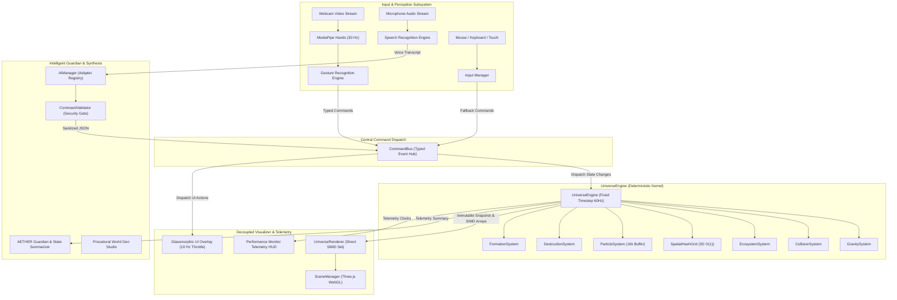
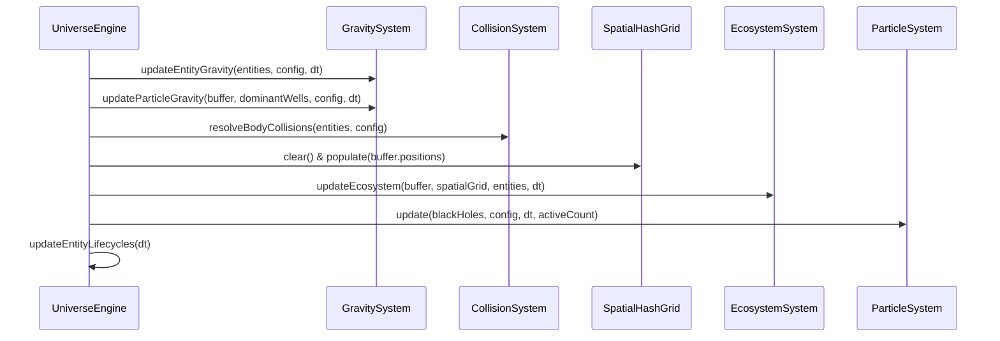
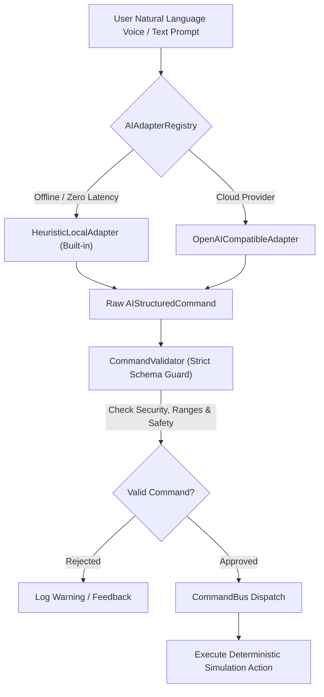
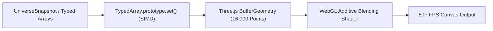

# 🏛️ AETHERIA: System Architecture & Technical Specification

## 1. System Overview & Core Philosophy

**AETHERIA** is architected around strict separation of concerns, deterministic physics execution, scale-invariant computer vision, and zero-runtime-allocation memory management.



---

## 2. Universe Simulation Kernel (`UniverseEngine`)

The simulation engine is completely decoupled from the DOM and WebGL renderers, operating as a deterministic pure mathematical state machine.

### Fixed-Timestep Accumulator Loop

To ensure identical physics across varied refresh rates (60Hz, 120Hz, 144Hz, 240Hz), simulation steps are executed using a fixed-timestep accumulator:

$$\Delta t_{\text{fixed}} = \frac{1}{60} \approx 0.016667\text{ s}$$

```typescript
public step(realDt: number): void {
  if (this.config.isPaused) return;
  const scaledDt = Math.min(0.1, realDt * this.config.timeScale);
  this.accumulator += scaledDt;
  while (this.accumulator >= this.config.fixedTimestep) {
    this.fixedTick(this.config.fixedTimestep);
    this.accumulator -= this.config.fixedTimestep;
  }
}
```

### Deterministic Subsystems



1. **`GravitySystem`**:
   - Softened celestial N-body interaction:
     $$\mathbf{a}_i = \sum_{j \neq i} \frac{G M_j (\mathbf{r}_j - \mathbf{r}_i)}{(|\mathbf{r}_j - \mathbf{r}_i|^2 + \epsilon^2)^{3/2}}$$
   - Keplerian orbital velocity calculation for stable concentric orbits:
     $$\mathbf{v}_{\text{orb}} = \sqrt{\frac{G M_{\text{center}}}{r}} \cdot \hat{\mathbf{t}}$$
   - Dominant mass well particle acceleration with relativistic accretion disk vortex swirl.

2. **`SpatialHashGrid` ($O(1)$ Partitioning)**:
   - Zero-allocation 3D hash table using flat `Int32Array` head and next pointer arrays.
   - Spatial coordinate hash:
     $$\text{hash}(c_x, c_y, c_z) = |(c_x \cdot 73856093) \oplus (c_y \cdot 19349663) \oplus (c_z \cdot 83492791)| \pmod N_{\text{table}}$$
   - Neighborhood radius queries executed in **$4.4\text{ }\mu\text{s}$ per lookup**.

3. **`EcosystemSystem`**:
   - Living particle ecology: `ENERGY`, `MATTER`, and `ORGANISM`.
   - Organisms seek radiant energy, avoid black holes, consume nutrients, metabolize energy over time, and undergo mitosis reproduction above health thresholds.

---

## 3. Computer Vision & Gesture Recognition Pipeline


### Scale-Invariant Feature Extraction

To ensure gestures work seamlessly regardless of user distance from the camera, all geometric measurements are normalized by the reference palm scale $S_{\text{palm}}$:

$$S_{\text{palm}} = \|\mathbf{p}_{\text{middle\_MCP}} - \mathbf{p}_{\text{wrist}}\|_2$$

$$\hat{\mathbf{p}}_i = \frac{\mathbf{p}_i - \mathbf{C}_{\text{palm}}}{S_{\text{palm}}}$$

- **Joint Angular Extension**: Cosine angle between proximal and distal phalanges:
  $$\cos \theta_j = \frac{\mathbf{u} \cdot \mathbf{v}}{\|\mathbf{u}\| \|\mathbf{v}\|}$$
- **Curvature / Circular Motion**: Trajectory heading angular integration $\Delta \theta \ge 1.5\pi$ over sliding 1-second window.
- **Dynamic Grab/Release**: First derivative of average finger curl:
  $$\dot{C} = \frac{\Delta C_{\text{avg}}}{\Delta t}$$

---

## 4. AI Subsystem & Architectural Decoupling

AETHERIA implements a provider-agnostic, strictly sandboxed AI layer. **The AI layer is NEVER permitted to execute raw JavaScript or mutate simulation objects directly.**



### AETHER: Intelligent Guardian

`AetherGuardian` queries `UniverseStateSummarizer` to analyze:

- Celestial stability metrics (kinetic temperature, velocity dispersion $\sigma_v$, gravitational balance)
- Detected cosmic anomalies (orbital collapse, biomass depletion, black hole tidal shear)
- Actionable simulation recommendations (gravity calibration, orbit realignment, energy seeding).

---

## 5. WebGL Rendering & SIMD Buffer Transfers



- Direct flat typed array memory streaming copies 45,000 floats in $< 0.15\text{ ms}$.
- Particle draw ranges are updated dynamically with `geometry.setDrawRange(0, activeParticles)`.
- Zero dynamic object allocations inside the WebGL render loop.
